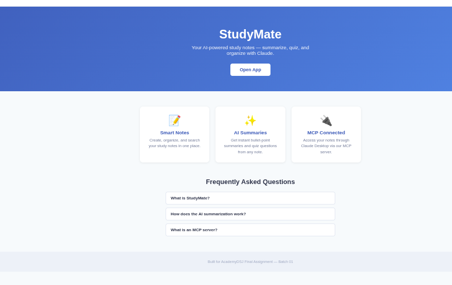
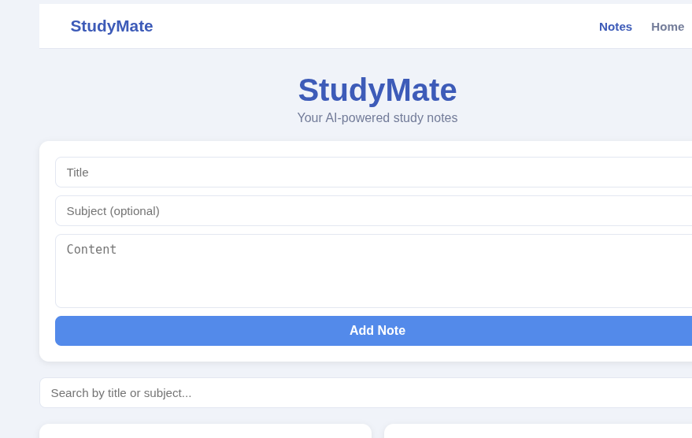
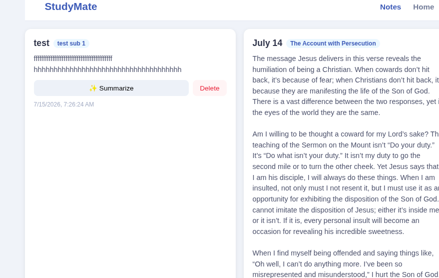
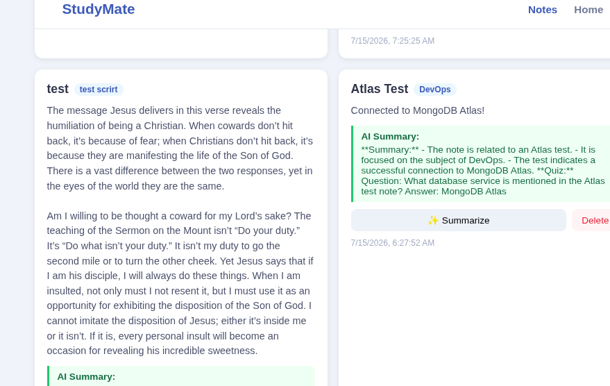
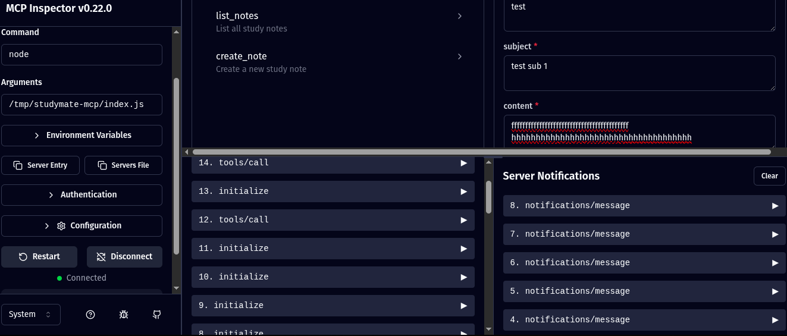
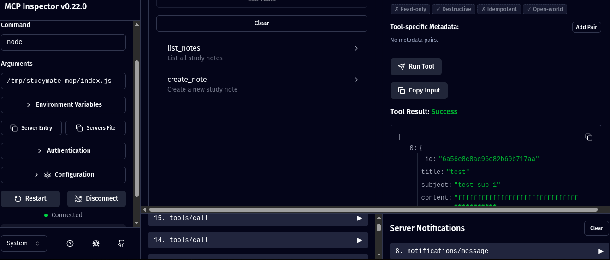

# StudyMate

AI-powered study notes app — summarize, quiz, and organize your notes with OpenAI and MCP.

## Tech Stack

- **Frontend:** React (Vite)
- **Backend:** Express.js + MongoDB Atlas (Mongoose)
- **AI:** OpenAI API (GPT-4o-mini)
- **MCP Server:** Model Context Protocol (stdio)
- **Landing:** HTML + CSS + Vanilla JS

## Setup

### Server

```bash
cd server
npm install
cp .env.example .env   # Add your MONGODB_URI and OPENAI_API_KEY
npm start              # Runs on http://localhost:5000
```

### Client

```bash
cd client
npm install
npm run dev            # Runs on http://localhost:5173
```

### MCP Server

```bash
cd mcp-server
npm install
node index.js          # Runs on stdio
```

## .env.example

```
MONGODB_URI=your_mongodb_atlas_connection_string_here
OPENAI_API_KEY=your_openai_api_key_here
PORT=5000
```

## Features

- Create, read, delete study notes
- Search notes by title or subject
- AI-powered summarization (3 bullet points + quiz question)
- MCP server for Claude Desktop integration
- Responsive landing page with FAQ accordion

## Screenshots

### Landing Page


### React App - Notes Empty State


### Add Note Form


### React App - Notes List


### AI Summarize Feature


### Search Notes


### MCP Inspector


## MCP Integration

Add to your Claude Desktop config (`claude_desktop_config.json`):

```json
{
  "mcpServers": {
    "studymate": {
      "command": "node",
      "args": ["/absolute/path/to/mcp-server/index.js"]
    }
  }
}
```

## License

AcademyDSJ Final Assignment — Batch 01
